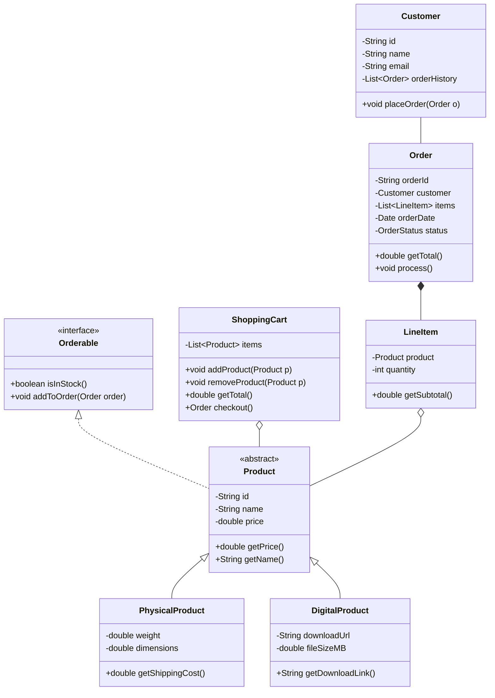

# UML Diagrams in Java with Mermaid - Cheatsheet

This README serves as a comprehensive reference for creating UML diagrams that represent Java code using Mermaid. It covers basic to advanced UML concepts tailored specifically for Java developers.

## Table of Contents
- [Mermaid Basics](#mermaid-basics)
- [Class Representations](#class-representations)
  - [Regular Classes](#regular-classes)
  - [Abstract Classes](#abstract-classes)
  - [Interfaces](#interfaces)
- [Relationships](#relationships)
  - [Inheritance (extends)](#inheritance-extends)
  - [Implementation (implements)](#implementation-implements)
  - [Association](#association)
  - [Aggregation](#aggregation)
  - [Composition](#composition)
  - [Dependency](#dependency)
- [Advanced Concepts](#advanced-concepts)
  - [Visibility Modifiers](#visibility-modifiers)
  - [Static Members](#static-members)
  - [Generic Types](#generic-types)
  - [Enumerations](#enumerations)
  - [Nested Classes](#nested-classes)
- [Complete Examples](#complete-examples)
- [Best Practices](#best-practices)

## Mermaid Basics

Mermaid diagrams are defined within code blocks in markdown. For class diagrams, use the `classDiagram` directive:


## Class Representations

### Regular Classes


### Abstract Classes

In Mermaid, abstract classes are denoted using the `<<abstract>>` classifier:


Note: The `*` after a method indicates it's abstract.

### Interfaces

Interfaces are represented using the `<<interface>>` classifier:


## Relationships

### Inheritance (extends)

In Java, a class can extend another class. This is represented with a solid line and an empty triangle pointing to the parent:


### Implementation (implements)

When a class implements an interface, it's shown with a dashed line and an empty triangle:


### Association

Represents a general relationship between classes:


### Aggregation

A special form of association where one class "has" another class but doesn't own it (the contained object can exist independently):


### Composition

A stronger form of aggregation where the contained class can't exist without the container:


### Dependency

When one class uses another class temporarily but doesn't store it:


## Advanced Concepts

### Visibility Modifiers

Mermaid uses symbols to denote visibility:
- `+` : public
- `-` : private
- `#` : protected
- `~` : package/default


### Static Members

Static members can be underlined in Mermaid:


Note: The `$` symbol indicates static members.

### Generic Types


### Enumerations


### Nested Classes

```mermaid
classDiagram
    class OuterClass {
        -int outerField
        +void outerMethod()
    }
    class OuterClass$StaticNestedClass {
        -int nestedField
        +void nestedMethod()
    }
    class OuterClass$InnerClass {
        -int innerField
        +void innerMethod()
    }
    
    OuterClass +-- OuterClass$StaticNestedClass
    OuterClass +-- OuterClass$InnerClass
```

## Complete Examples

### Example 1: Online Store System



### Example 2: Design Patterns (Observer)


## Best Practices

1. **Keep It Simple**: Only include essential classes and relationships to avoid overwhelming diagrams.
   
2. **Use Meaningful Names**: Choose descriptive names for classes, methods, and attributes.
   
3. **Group Related Classes**: Organize your diagram by placing related classes near each other.
   
4. **Add Notes When Needed**: Use notes to explain complex relationships or design decisions.

5. **Consistent Notation**: Maintain consistent use of UML notation throughout your diagrams.

6. **Limit Diagram Size**: Break large systems into multiple diagrams focused on specific aspects.

7. **Include Key Methods Only**: For complex classes, only show the most important methods and attributes.

8. **Document Design Decisions**: Add comments explaining why certain design choices were made.

9. **Keep Diagrams Updated**: Update your UML diagrams when code changes significantly.

10. **Review with Team**: Use diagrams as communication tools with your development team.
